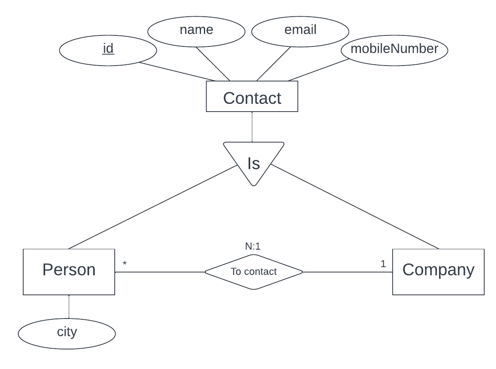
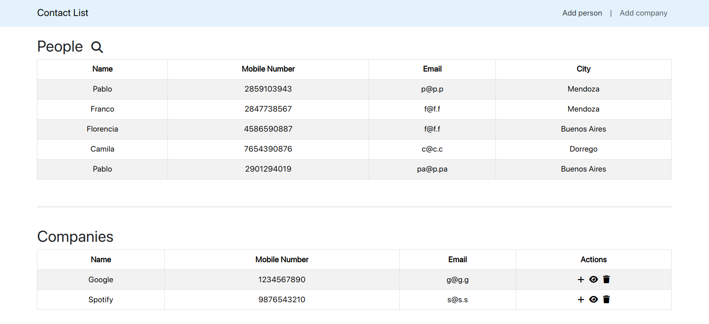

# Contact List

### Tecnologías utilizadas

- Java 21
- Spring Boot 3.2.1
- MySQL
- Angular 16

### Modelo Entidad Relación

  

### Frontend

  

### Pruebas
- El archivo **"ContactList - Postman.json"** contiene la colección de Postman con todas las requests necesarias para probar el sistema.

- Se puede acceder a **Swagger** ejecutando el backend e ingresando a **http://localhost:8080/swagger-ui/index.html**